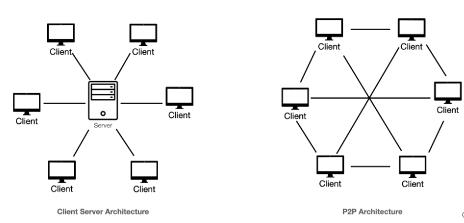

# Le peer-to-peer et ses particularités

Source : [GeekForGeek](https://www.geeksforgeeks.org/system-design/distributed-systems-vs-peer-to-peer-networks/)

Les réseaux peer-to-peer sont des réseaux décentralisés qui permettent une communication directe entre les nœuds sans serveur central.&#x20;

Dans un réseau P2P, chaque participant (ou pair) peut agir à la fois comme client et serveur, favorisant ainsi le partage des ressources et la collaboration.

Les caractéristiques des réseaux peer-to-peer sont les suivantes :

| Caractéristiques      | Description                                                                                                                                                      |
| --------------------- | ---------------------------------------------------------------------------------------------------------------------------------------------------------------- |
| Décentralisation      | Aucune autorité centrale ne contrôle le réseau, ce qui lui confère une plus grande résilience.                                                                   |
| Evolutivité           | De nouveaux "peer" peuvent facilement rejoindre le réseau, qui peut gérer des charges accrues à mesure que davantage de participants contribuent aux ressources. |
| Redondance            | Les données sont souvent répliquées sur plusieurs pairs, ce qui offre un certain niveau de sauvegarde et de tolérance aux pannes.                                |
| Nature dynamique      | Les pairs peuvent rejoindre ou quitter le réseau librement, ce qui rend l'architecture flexible et adaptable.                                                    |
| Structures incitative | De nombreux réseaux P2P utilisent des incitations pour encourager la participation, telles que les cryptomonnaies dans les réseaux blockchain.                   |

<figure><figcaption></figcaption></figure>

Source : [System design school](https://app.gitbook.com/u/gLwkRcQhqmTsLWK78RevYt7Dc1e2)

